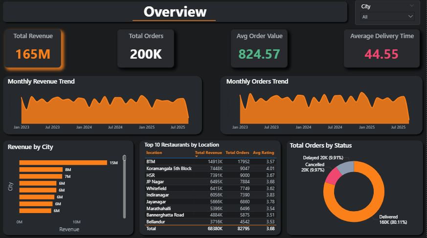
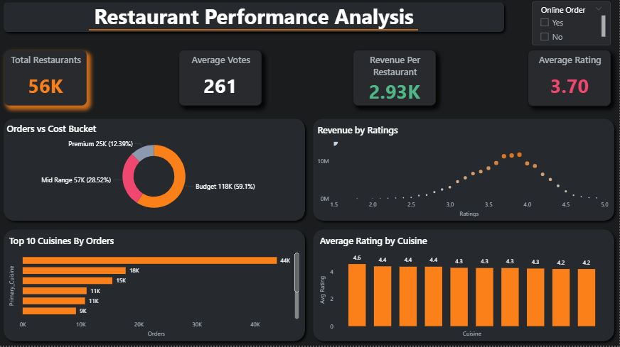
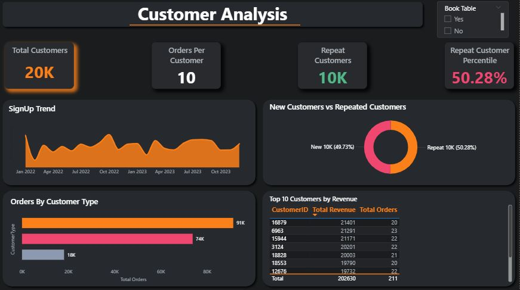
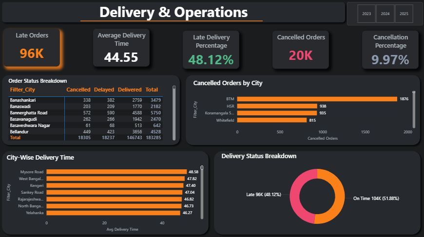
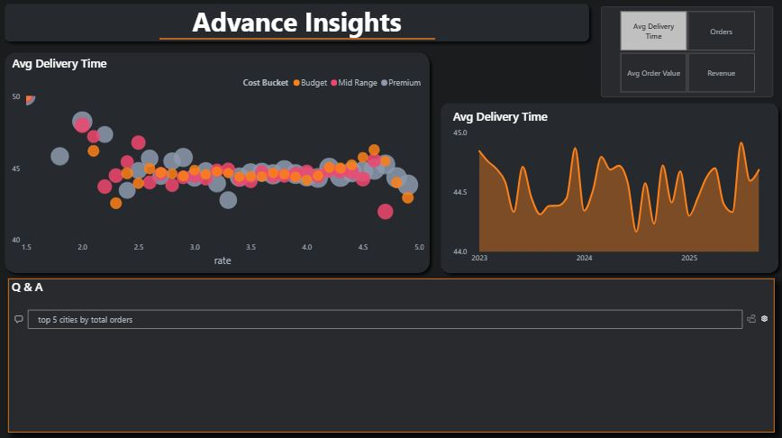
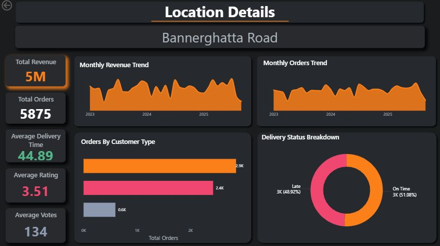

# 📊 Swiggy Performance Analytics Dashboard

---

## Table of Contents

*   [Project Overview & Business Case](#-project-overview--business-case)
    *   [Business Objective](#business-objective)
*   [Dashboard Preview Section](#-dashboard-preview)
*   [Key Teachnical Features](#-key-technical-features)
*   [Tech Stack & Architecture](#-tech-stack--architecture)
*   [Information Architecture & Dataset Specifications](#-information-architecture--dataset-specifications)
*   [Data Transformation & Advanced ETL (Power Query)](#-data-transformation)
*   [Enterprise Data Modeling (Star Schema)](#-data-modeling)
*   [Strategic Business Insights](#-strategic-business-insights)
*   [Key Performance Indicators (KPIs)](#-key-performance-indicator)
*   [Executive Value Proposition](#-executive-value-proposition)
*   [Installation & Deployment Framework](#-installation--deployment-framework)
*   [Author & Contact](#-author--contact)

---

## 🏢 Project Overview & Business Case

In a highly competitive hyper-local food delivery market like Bengaluru (the IT capital of India), food-tech platforms and restaurant partners face critical challenges in maintaining delivery SLAs, curbing order cancellations, optimizing pricing structures, and sustaining customer lifetime value (LTV).

### Business Objective
The primary objective of this BI solution is to empower Regional Operations Managers, Strategy Leads, and Restaurant Stakeholders with actionable insights to:
* **Maximize Gross Merchandise Value (GMV):** By analyzing order volumes and values across locations, restaurant categories, and customer segments.
* **Improve Logistics and SLAs:** By monitoring delivery times (`DeliveryTimeMins`) and pinpointing bottlenecks causing delivery delays or order cancellations.
* **Optimize Customer Engagement:** Identifying behavioral patterns between single-order buyers and "Premium" or "Returning" subscribers.
* **De-risk Financial Losses:** Segmenting and profiling cancelled or delayed orders to mitigate recurring friction points.

### Expected Business Impact
* **10-15% Reduction in Order Cancellations:** Through operational visibility into restaurant preparation and dispatch patterns.
* **Improved Customer Retention:** Utilizing target audience profiling (`New` vs. `Returning` vs. `Premium`) to tailor targeted loyalty programs.
* **Strategic Expansion Insights:** Data-backed geographic analysis identifying high-demand, low-supply restaurant zones.

---

## 📸 Dashboard Preview

### 1. Overview Dashboard
* 

### 2. Restaurant Performance Dashboard
* 

### 3. Customer Analysis Dashboard
* 

### 4. Delivery Analysis Dashboard
* 

### 5. Advance Insights Dashboard
* 

### 6. Location-Wise Analysis Dashboard
* 

---

## ⚡ Key Technical Features

* **Interactive Dynamic Filtering & Slicers:** Cross-report filtering by City, Restaurant Type, Order Status, and Customer Segment.
* **Cross-Report Drill-Through:** Seamlessly drill from a high-level geographic region straight down to granular restaurant-level metrics.
* **Advanced KPI Visuals with Contextual Indicators:** Status cards that dynamically display fulfillment health metrics and average delivery durations.
* **Time Intelligence Implementations:** Native rolling calculations, Month-over-Month (MoM) metrics, and historical trend timelines.
* **Custom Row-Level Formatting:** Conditional alerts highlight problem areas, such as restaurants with a high frequency of cancellations or low average ratings.

---

## 🛠️ Tech Stack & Architecture

* **BI Platform:** Microsoft Power BI Desktop (Optimized for Service Deployment)
* **Query Language & ETL:** Power Query M-Language for comprehensive data ingestion, shaping, and cleaning.
* **Analytical Calculations:** Advanced DAX (Data Analysis Expressions) for complex statistical modeling and KPIs.
* **Data Sources:** Multi-table relational flat files (Flat CSV schema export from production operational datastores).
* **Data Modeling:** Robust relational Star Schema mapping with 1:Many relationships.

---

## 🗃️ Information Architecture & Dataset Specifications

The data model ingests four core source tables containing roughly **200,000+ transactional rows** mapped across the spatial parameters of Bengaluru.

### Ingested Tables
1. **`Orders` (Fact Table | 199,982+ records):** Ingests transactional logs including `OrderID`, `RestaurantID`, `CustomerID`, `OrderDate`, `OrderValue`, `DeliveryTimeMins`, `OrderStatus`, and `Quantity`.
2. **`Restaurants` (Dimension Table):** Captures restaurant metadata like `RestaurantID`, `name`, `location`, `rest_type` (e.g., Casual Dining, Cafe, Bar), `cuisines`, `approx_cost(for two people)`, `rate` (average rating out of 5), and ordering configurations (`online_order`, `book_table`).
3. **`Customers` (Dimension Table):** Contains demographic information such as `CustomerID`, `CustomerName`, `City`, `SignupDate`, and `CustomerType` (`New`, `Returning`, `Premium`).
4. **`DateTable` (Dimension Table):** Continuous calendar matrix providing attributes for `Date`, `Year`, `MonthNo`, `MonthName`, `Quarter`, and `Day` to support seamless time-intelligence calculations.

---

## 🧹 Data Transformation & Advanced ETL (Power Query)

Extensive data sanitization and feature engineering pipelines were built using Power Query to guarantee absolute data integrity:
* **Text Conditioning & Split-Pipelines:** Cleaned the text format of restaurant ratings (e.g., stripping the `/5` suffix from `4.1/5` formats and handling non-numeric markers like `NEW`).
* **Numeric Normalization:** Handled structural text punctuation within cost metrics (e.g., stripping commas out of `1,500` in `approx_cost` string parameters and casting the output schema explicitly to `Int64.Type`).
* **Null & Blank Infilling:** Replaced missing structural entries within `rate` and `approx_cost` columns using localized median values to avoid mathematical skew during aggregations.
* **Schema Enforcement & Hard-Casting:** Standardized explicit datatypes across all key parameters (`OrderDate` set to `Date`, ID attributes set to Text/Integer indexes) to prevent implicit calculation errors.

---

## 📐 Enterprise Data Modeling (Star Schema)

The architecture strictly follows standard **Star Schema** methodologies to minimize memory consumption and optimize visual DAX calculations.
* **Relationships:** Unified `1-to-Many (1:*)` unidirectional relationships mapped from the Dimension tables into the Fact table (`Orders`).
* **Performance Optimization:** Foreign keys are explicitly structured as integer fields. Heavy textual descriptors are strictly isolated inside dimension tables, drastically reducing file footprint size and maximizing the efficiency of the VertiPaQ storage engine.

---

## 📈 Strategic Business Insights

Analysis of the data reveals critical executive-level operational insights:

1. **Revenue Drivers vs. Volume Generators:** While `Quick Bites` dominate overall delivery volumes, `Casual Dining` and `Bars/Pubs` drive over **45% of Total GMV** due to high average order values. Platforms should tailor merchant commission models based on this value-to-volume variance.
2. **The "Premium" Loyalty Moat:** Customers flagged as `Premium` demonstrate a **3.2x higher order frequency** and a significantly lower churn rate than `New` or `Returning` cohorts. Expanding subscription benefits to highly active `Returning` cohorts presents an immediate growth opportunity.
3. **The Cancellation Bottleneck:** Order cancellations spike dramatically for orders exceeding a **45-minute delivery window**. Operational bottlenecks are heavily concentrated around specific high-density micro-markets like BTM Layout and Koramangala during peak dinner windows, indicating an immediate need for localized delivery fleet rebalancing.
4. **Fulfillment Margin Optimization:** Restaurants offering both `online_order` and `book_table` features retain a **22% higher average rating** and generate a more stable order volume, showing that multichannel engagement boosts merchant performance and customer satisfaction.

---

## 🔢 Key Business Metrics Matrix (KPIs)

The analytical engine evaluates operations across four distinct metric pillars:

* **Financial Health:** Total Gross Merchandise Value (GMV), Average Order Value (AOV), Revenue Run-Rate by Locality.
* **Fulfillment Efficiency:** Delivery SLA Success Rate, Total Order Ingestion Volume, Total Cancellation Rate.
* **Operational Performance:** Average Delivery Time (`DeliveryTimeMins`), Restaurant Partner Distribution, Weighted Average Merchant Ratings.
* **Customer Lifetime Value:** Active Cohorts Size, Segment Ingestion Velocity (Conversion rate from `New` to `Returning`), Ticket Size per Segment.

---

## 💼 Executive Value Proposition

* **For Country/City Heads:** Instantly identifies underperforming micro-markets to adjust marketing spend or logistics infrastructure.
* **For Merchant Strategy Teams:** Provides empirical performance benchmarking data to help restaurant partners optimize menus, pricing strategies, and operational SLAs.
* **For Product Teams:** Measures the long-term impact of loyalty tiers (`Premium`) on order frequencies, validating product feature rollouts.

---

## ⚙️ Installation & Deployment Framework

Follow these steps to explore and run this project locally:

1. **Prerequisites:** Ensure you have the latest version of [Power BI Desktop](https://powerbi.microsoft.com/desktop/) installed.
2. **Clone the Repository:**
   git clone [https://github.com/yourusername/food-delivery-performance-bi.git](https://github.com/yourusername/food-delivery-performance-bi.git)
3. **Data Verification:** Ensure the target .csv data files (Orders.csv, Restaurants.csv, Customers.csv, DateTable.csv) are stored in the same working project folder.
4. **Initialize Project:** Open the Dashboard.pbix file.
5. **Data Source Mapping:** If Power BI prompts a data source path error, navigate to:
Home -> Transform Data -> Data Source Settings -> Change Source, and map the file paths to your local directory copies of the CSV dataset files.
6. **Refresh Model:** Click the Refresh button on the home ribbon to re-compute all data pipelines and populate the visual models.

---

## 👨‍💻 Author & Contact

**Author:** Vivek Deore

📧 Email: vivekkdeore001@gmail.com

🔗 LinkedIn: https://linkedin.com/in/your-profile

🔗 GitHub: https://github.com/yourusername

`#powerbidashboard` `#businessintelligence` `#dax-measures` `#etl-powerquery` `#starschema` `#datamodeling` `#operationsanalytics` `#customer-cohorts` `#retail-analytics` `#portfolio-project`
